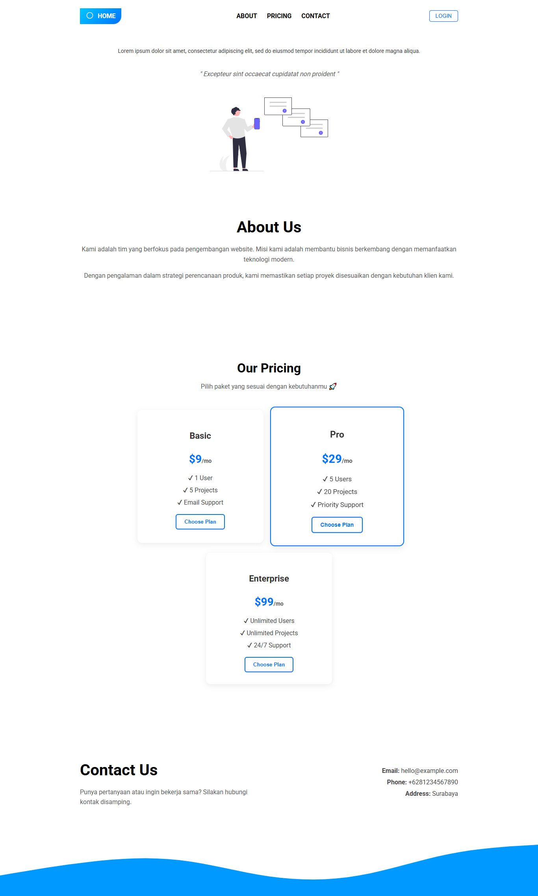

# Dokumentasi Web Test

Dokumentasi ini memberikan rincian tentang font dan ilustrasi yang digunakan dalam proyek ini.

## CSS Module

Proyek ini menggunakan **CSS Modules** untuk mengatasi beberapa masalah umum yang sering terjadi pada CSS biasa, seperti:

1.  Menghindari konflik nama class
2.  Scope lokal
3.  Struktur yang lebih rapi

## Font

- **Jenis Font**: Font utama yang digunakan di seluruh situs web adalah **Roboto**, dengan fallback ke `sans-serif`. Font ini dipilih karena sudah sangat familiar digunakan untuk UI website maupun Apps

- **Ukuran Font**:
  - **14px**: Digunakan untuk teks hero dan detail harga.
  - **16px**: Digunakan untuk subjudul di bagian harga.
  - **22px**: Digunakan untuk judul kartu di bagian harga.
  - **28px**: Digunakan untuk harga utama di bagian harga.
  - **32px**: Digunakan untuk judul utama di bagian harga.
  - **1rem (16px)**: Ukuran standar untuk input dan tombol modal.
  - **1.8rem (28.8px)**: Digunakan untuk tombol tutup di modal.
  - **2.5rem (40px)**: Digunakan untuk judul bagian di "Tentang" dan "Kontak".

- **Warna Font**:
  - `#000000` (Hitam): Warna teks default.
  - `#333333`, `#444444`, `#555555`, `#666666`: Berbagai warna abu-abu untuk teks dan subjudul.
  - `#FFFFFF` (Putih): Digunakan untuk teks dengan latar belakang gelap atau berwarna.
  - `#0072ff`: Warna biru utama yang digunakan untuk tautan, tombol, dan sorotan.
  - `#00c6ff`: Warna biru muda yang digunakan dalam gradien.
  - `#7d2ae8`: Warna ungu yang digunakan dalam gradien.
  - **Gradien**:
    - `linear-gradient(135deg, #00c6ff, #0072ff)`
    - `linear-gradient(90deg, #00c6ff, #7d2ae8)`

## Ilustrasi

Ilustrasi yang digunakan dalam proyek ini berasal dari [unDraw](https://undraw.co/search). Secara khusus, gambar `hero.svg` digunakan di halaman utama.

## Hasil Screenshot
